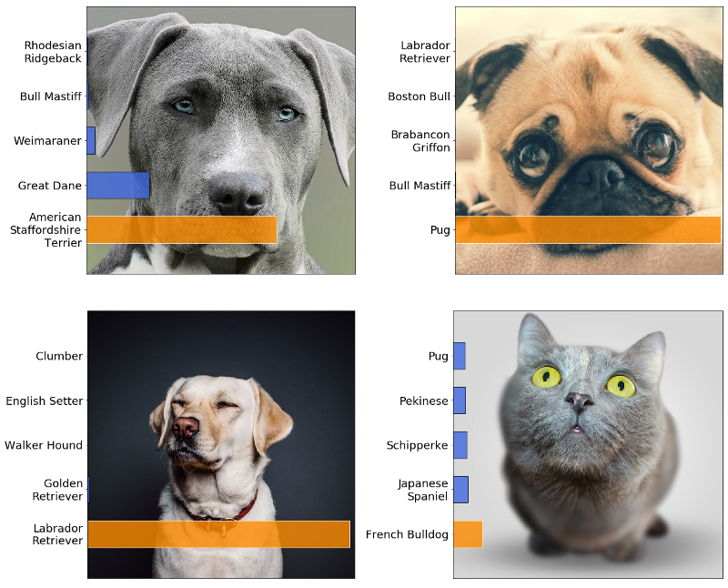
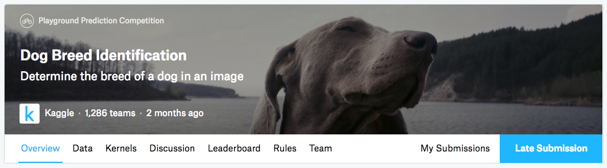

# image-classification-template

[Image Classification or Identification](https://en.wikipedia.org/wiki/Computer_vision#Recognition) is one of the most common [CV](https://en.wikipedia.org/wiki/Computer_vision) problems. The goal is to analyze an image and predict the main object represented. 
*What can you use it for?* Here are a few ideas - detecting diseases from medical images, monitoring the status of plants before the harvest and recognize person, animals and objects.  

### Predicting breed of dog images

In this notebook, we will apply [Transfer Learning](https://cs231n.github.io/transfer-learning/) by building new layers on top of Xception mode pre-trained on ImageNet to classify the first 10 dog breeds classes of the dog-breed dataset.

*Note: we have reduced the number of class to fit the model in the CPU instance.*

We will use the [Kaggle's Dog Breed Dataset](https://www.kaggle.com/c/dog-breed-identification) dataset for training our model. The dataset is subset of ImageNet in order to practice fine-grained image categorization. How well you can tell your Norfolk Terriers from your Norwich Terriers? With 120 breeds of dogs and a limited number training images per class, you might find the problem more, err, ruff than you anticipated.

We will:
- Preprocess images data for CV
- Transfer Learning: Build new layers on top of Xception model pre-trained on ImageNet using Keras and Tensorflow
- Evaluate our model on the test set
- Run the model on new dog images from the web!
